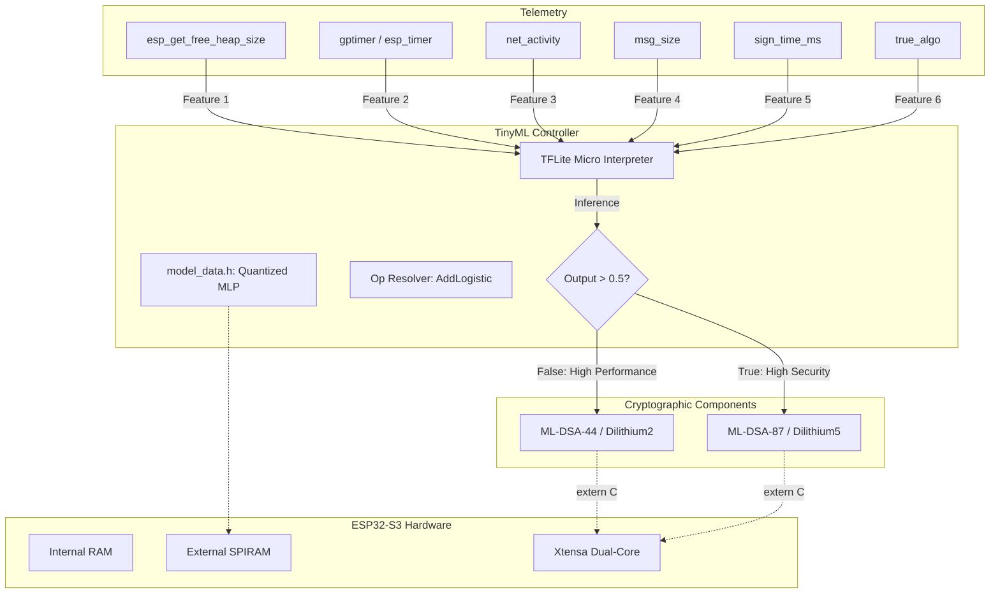
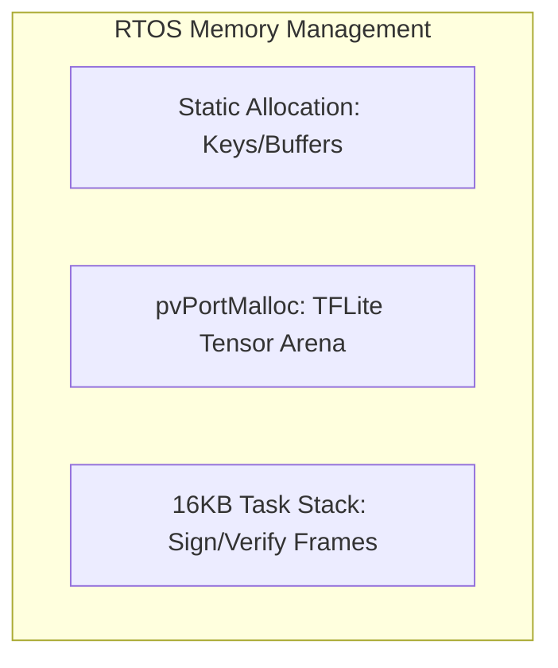

### Introduction

The integration of Post-Quantum Cryptography (PQC) on embedded systems presents a critical trade-off between cryptographic strength and operational stability. Algorithms like ML-DSA-87 (Dilithium5) offer superior security but demand significant CPU cycles and stack memory, which can lead to task starvation or system crashes on resource-constrained hardware. SleeQC addresses this by implementing a TinyML-based controller that monitors real-time system metrics—specifically heap availability and execution latency—to dynamically switch between ML-DSA-44 and ML-DSA-87, ensuring the highest possible security level without compromising RTOS responsiveness.

---

### Key Concept Definitions

* **Quantization:** The process of mapping continuous infinite values to a smaller set of discrete finite values; in TinyML, this typically involves converting 32-bit floating-point weights to 8-bit integers to reduce memory footprint and latency.
* **Inference:** The execution phase where a trained machine learning model processes real-time input data (features) to produce a prediction or decision.
* **Bare-metal:** Software execution directly on hardware without a full operating system abstraction layer, often requiring manual memory management and register-level peripheral control.
* **Stack High Water Mark (HWM):** A diagnostic metric in FreeRTOS indicating the minimum amount of remaining stack space available since the task began; essential for identifying near-overflow conditions in memory-intensive cryptographic operations.

---




### How does SleeQC handle dynamic algorithm switching?

The core logic resides within a dedicated `pqc_worker_task`. The system avoids static overhead by maintaining a feedback loop that evaluates the cost of the previous cryptographic operation against the current state of the heap.

```c
// Critical Logic: Adaptive PQC Selection Loop
float inputs[2] = { (float)free_heap / 1024.0f, (float)duration_ms };
float prediction = ml_runner.predict(inputs);

if (prediction > 0.5f) {
    // Execute High-Security ML-DSA-87
    pqc_mldsa87_sign(sig, &siglen, msg, msglen, sk87);
    current_algorithm = 1;
} else {
    // Execute High-Performance ML-DSA-44
    pqc_mldsa44_sign(sig, &siglen, msg, msglen, sk44);
    current_algorithm = 0;
}

```

**Technical Analysis:**

1. **Feature Scaling:** The code normalizes the `free_heap` by dividing by 1024.0f, converting bytes to KB to match the input scale expected by the TFLite model.
2. **Pointer Pass-through:** The signing functions use pass-by-reference for `siglen` and message buffers. Because Dilithium is stack-heavy, the pointers must point to memory outside the immediate stack frame if possible, or the task stack must be pre-allocated with sufficient padding (e.g., 16KB).
3. **Threshold Logic:** The 0.5f threshold implements a binary classifier. The model's output (typically a Sigmoid activation) represents the probability of the system being in an "Idle" state where Dilithium5 can be safely executed.
4. **Multi Layer Perceptron:** The telemetry vector, obtained as a result of running a custom MLP algorithm trained on the [labeled telemetry dataset](https://www.kaggle.com/datasets/divyeshkamalanaban/esp32-ml-dsa-resource-usage-dataset-for-tinyml1),recorded for 5000-6000 samples per algorithm. MLP isn't as heavy as a full on neural network, container only a couple of layers, which can work efficiently without interrupting other tasks on edge devices.

---

### What are the memory management requirements for PQC?

Standard IoT devices often default to 2KB-4KB task stacks. SleeQC demonstrates that ML-DSA-87 requires a minimum of 16KB to prevent `LoadProhibited` exceptions or stack smashing. The project utilizes `esp-nn` (Espressif’s Neural Network library) to accelerate the TFLite inference, offloading the decision-making overhead from the main CPU.

#### Memory Management Analysis:

* **Static Allocation:** The use of `static_sk87` ensures the secret keys reside in the `.bss` or `.data` segments (ideally in PSRAM). This avoids calling `pvPortMalloc` during the hot path of the signing loop, reducing latency and fragmentation.

* **Direct Tensor Access:** Using `ml_runner`, `get_input_tensor()` returns a direct pointer to the Tensor Arena. This eliminates an intermediate memcpy, saving CPU cycles—a critical optimization for real-time inference.

### How is the TFLite interpreter integrated with C components?

To prevent C++ name mangling from breaking links to the C-based PQC components, the implementation utilizes `extern "C"` blocks. Furthermore, the `tflite_runner.h` must explicitly register the `LOGISTIC` op. Without this manual registration, the interpreter fails at runtime because the `model_data.h` contains operations that the default micro-op resolver does not include to save flash space.

---

### Hardware Implications

The SleeQC architecture is optimized for the **ESP32-S3**. The inclusion of PSRAM is highly recommended due to the concurrent memory requirements of the TFLite tensor arena and the large secret keys required for Dilithium5. While portable to **STM32** (via X-CUBE-AI) or other **ARM Cortex-M** platforms, the specific utilization of `esp-tflite-micro` and `esp-nn` provides a performance advantage on Xtensa-based architectures through hardware-accelerated MAC (Multiply-Accumulate) operations.